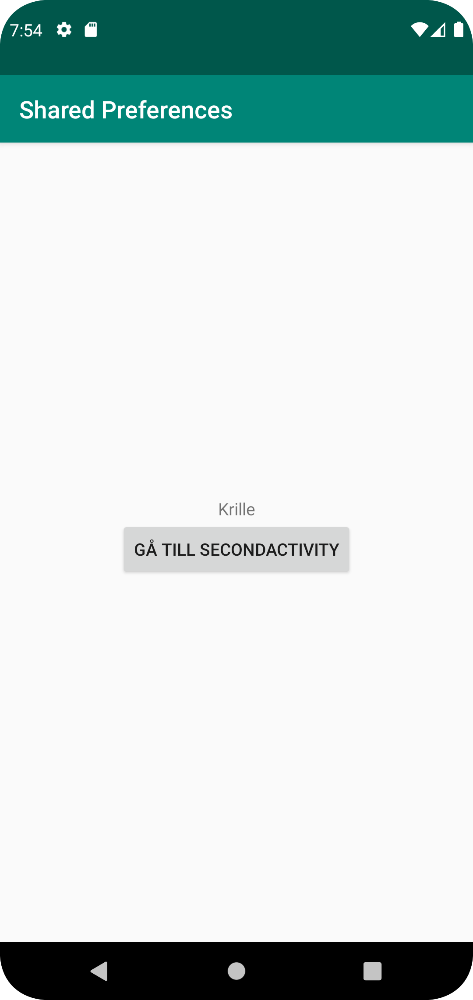

## Stylandet av activity_main.xml

- Det första jag gjorde för att tillfredsställa kraven var att skapa en TextView samt en Button
i min activity_main.xml. Detta för att ha en TextView där SharedPreferences kan presenteras, samt
en knapp som kan ta användaren vidare till den andra aktiviteten, SecondActivity.java
  
```
    <TextView
        android:id="@+id/namepresent"
        android:layout_width="wrap_content"
        android:layout_height="wrap_content"
        android:text="@string/intro_text"
        app:layout_constraintBottom_toBottomOf="parent"
        app:layout_constraintEnd_toEndOf="parent"
        app:layout_constraintStart_toStartOf="parent"
        app:layout_constraintTop_toBottomOf="parent"
        app:layout_constraintBottom_toTopOf="parent"
        />


    <Button
        android:id="@+id/forward"
        android:layout_width="wrap_content"
        android:layout_height="wrap_content"
        app:layout_constraintTop_toBottomOf="@id/namepresent"
        app:layout_constraintEnd_toEndOf="parent"
        app:layout_constraintStart_toStartOf="parent"
        android:text="Gå till secondactivity"
        />
```

## Skapandet samt stylandet av activity_second.xml

- Sedan så skapade jag en andra aktivitet, nämligen SecondActivity där datan som sparas till SharedPreferences kan matas in,
till denna har jag även en TextView som berättar vad EditText rutan tillför, samt en knapp som tar användaren tillbaka
till den första aktiviteten och en knapp som sparar det inmatade värdet.
  
## Intents

- Eftersom att jag skapat två knappar, en på vardera aktivitet som tar användaren till den andra aktiviteten, oberoende av
vilken användaren för tillfället är på, så har jag använt mig av intents.
```
        goback = findViewById(R.id.back);
        goback.setOnClickListener(new View.OnClickListener(){
            @Override
            public void onClick(View view) {
                Log.d("==>", "Back button pressed");
                Intent intent = new Intent (SecondActivity.this, MainActivity.class);
                startActivity(intent);
            }
        });
```
- Detta exempel är från min SecondActivity.java, men samma princip följer i min MainActivity.java. Här skapar jag endast en OnClickListener
som skapar en ny intent samt aktiverar denna för att förflytta användaren när hen klickar på knappen.
  
## Inmatandet av det sparade värdet.

- För att jag ska kunna mata in data til SharedPreferences så måste jag först skapa en sådan, sedan tilldela den ett värde på en OnClickListener som följande:

```
        username = findViewById(R.id.edit_text);
        button = findViewById(R.id.save);
        namepresent = findViewById(R.id.namepresent);
        preferences = getSharedPreferences(("preferences"), MODE_PRIVATE);
        button.setOnClickListener(new View.OnClickListener() {
            @Override
            public void onClick(View view) {
                SharedPreferences.Editor editor = preferences.edit();
                editor.putString("name", username.getText().toString());
                editor.apply();
            }
        });
```
- Vad jag egentligen gör här är först hämtar alla delar från xml-filen med findViewById, sedan så säger jag åt min preferences, som är av typen SharedPreferences,
att hämta preferences. Sedan skapar jag en OnClickListener för den knappen som sparar datan, och säger att när denna
klickas så skall preferences ändras, sedan matas datan från EditText-en "username" in i SharedPreferences som en "toString",
sedan apply för att spara detta.
  
## Hämtandet av det sparade värdet.
- För att hämta och presentera det sparade värdet jag har en "onResume" i min MainActivity, denna klass körs alltså
automatiskt när denna aktivitet öppnas igen, men inte på skapandet. Därmed kommer detta värde skapas lokalt och öppnas varje gång
applikationen igen öppnas.
  
```
    @Override
    protected void onResume() {
        super.onResume();
        String name = preferences.getString("name", "inget namn hittades");
        namepresent.setText(name);
    }
```  

- Detta är hur denna ser ut, här så gör jag endast som så att jag säger att String name får värdet som är sparat till preferences,
och sedan infogar jag denna variabels värde till den TextView vid namn "namepresent" som visar upp texten på mobilapplikationens sida.
  




